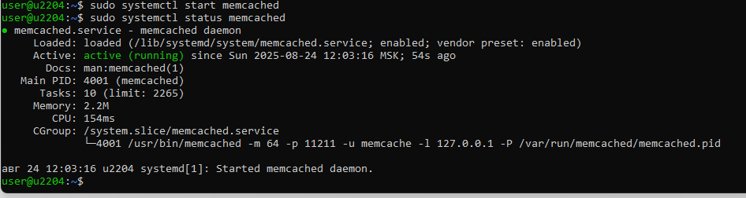
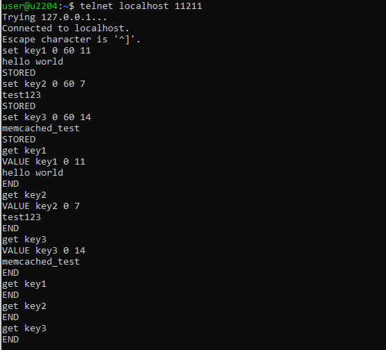
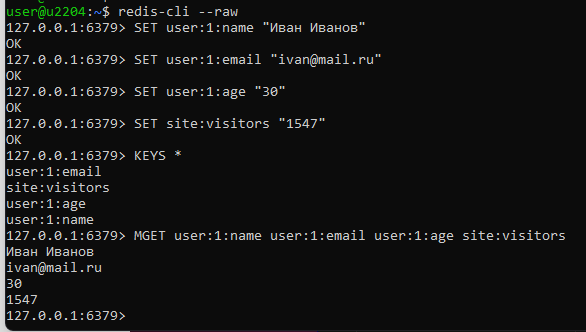
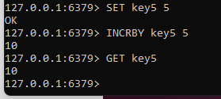

# Домашнее задание к занятию "`8_03_Кластеризация и балансировка нагрузки`" - `Девятов Илья`

### Задание 1
Приведите примеры проблем, которые может решить кеширование.

**Решение**

| Проблема | Пример | Решение через кеширование |
| :--- | :--- | :--- |
| **Высокая задержка** | Медленная загрузка страницы | Хранение данных в быстрой оперативной памяти |
| **Высокая нагрузка** | Падение БД во время распродажи | Снятие нагрузки с основного источника данных |
| **Повторные вычисления** | Генерация одной и той же страницы | Сохранение результата вычислений |
| **Высокая стоимость** | Платные API | Снижение количества дорогостоящих вызовов |
| **Низкая доступность** | Отказ базы данных | Отдача данных из кеша при недоступности основного источника |

---

### Задание 2 Memcached

Установите и запустите memcached.
Приведите скриншот systemctl status memcached, где будет видно, что memcached запущен.

### Задание 3 Удаление по TTL в Memcached

Запишите в memcached несколько ключей с любыми именами и значениями, для которых выставлен TTL 5.
Приведите скриншот, на котором видно, что спустя 5 секунд ключи удалились из базы.

# руками за 5 секунд не успеть, поставил 60

### Задание 4 Запись данных в Redis

### Задание 5*. Работа с числами

