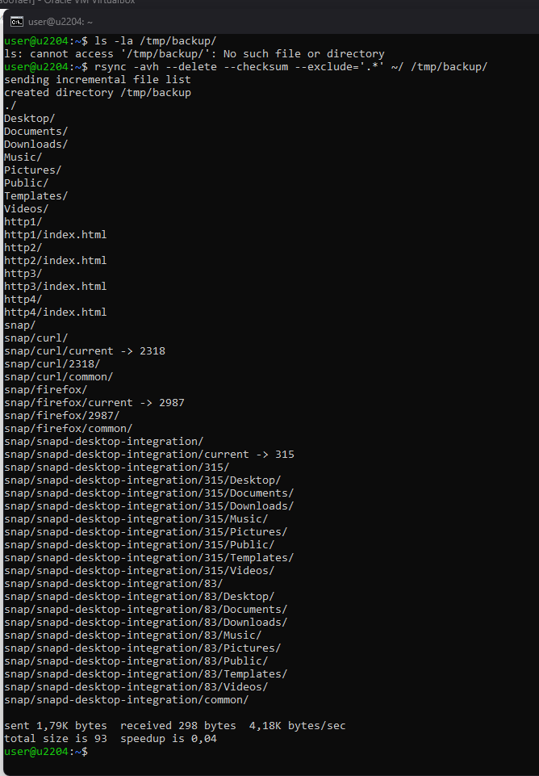
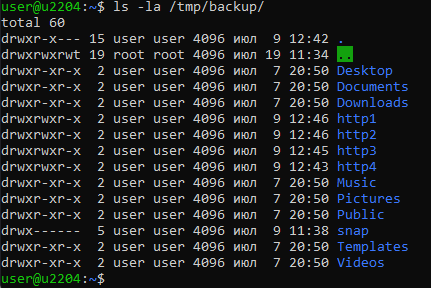
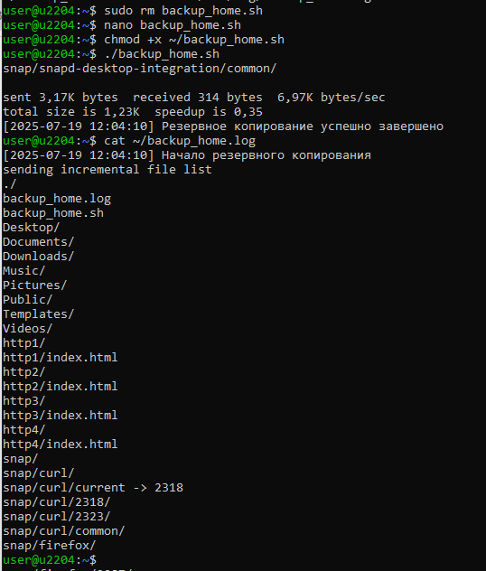
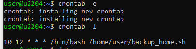
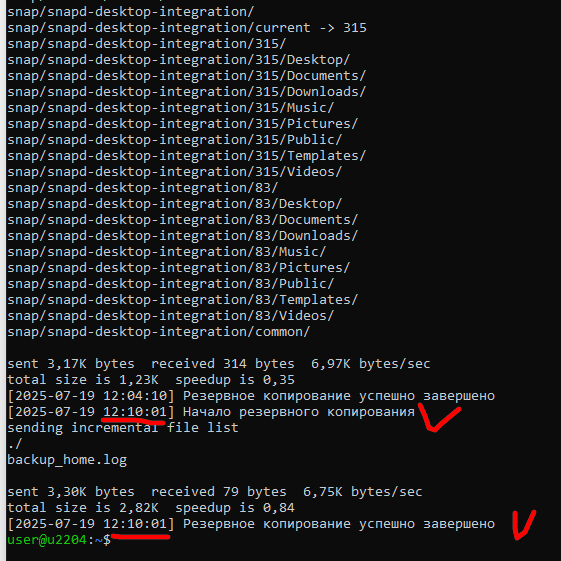

Домашнее задание "Резервное копирование" Девятова Ильи

Задание 1
Составьте команду rsync, которая позволяет создавать зеркальную копию домашней директории пользователя в директорию /tmp/backup
Необходимо исключить из синхронизации все директории, начинающиеся с точки (скрытые)
Необходимо сделать так, чтобы rsync подсчитывал хэш-суммы для всех файлов, даже если их время модификации и размер идентичны в источнике и приемнике.
На проверку направить скриншот с командой и результатом ее выполнения

```bash
rsync -avh --delete --checksum --exclude='.*/' ~/ /tmp/backup/
-a — архивный режим (сохраняет атрибуты файлов, рекурсивно копирует)

-v — подробный вывод (verbose)

-h — человеко-читаемые размеры файлов

--delete — удаляет файлы в приемнике, которых нет в источнике (зеркализация)

--checksum — проверяет хэш-суммы файлов, даже если время и размер совпадают

--exclude='.*/' — исключает все скрытые директории (начинающиеся с точки)

~/ — исходная директория (домашняя папка пользователя)

/tmp/backup/ — целевая директория для резервной копии 
```

'
'

Задание 2
Написать скрипт и настроить задачу на регулярное резервное копирование домашней директории пользователя с помощью rsync и cron.
Резервная копия должна быть полностью зеркальной
Резервная копия должна создаваться раз в день, в системном логе должна появляться запись об успешном или неуспешном выполнении операции
Резервная копия размещается локально, в директории /tmp/backup
На проверку направить файл crontab и скриншот с результатом работы утилиты.

создаем скрипт backup_home.sh:

```bash
/bash

# Настройки
BACKUP_DIR="/tmp/backup"
LOG_FILE="$HOME/backup_home.log"  # Теперь лог пишется в домашнюю директорию
SOURCE_DIR="$HOME"

# Создаем директорию для бэкапа
mkdir -p "$BACKUP_DIR"

# Записываем время начала
echo "[$(date +'%Y-%m-%d %H:%M:%S')] Начало резервного копирования" >> "$LOG_FILE"

# Запускаем rsync
rsync -avh --delete --checksum --exclude='.*' --no-perms --no-owner --no-group "$SOURCE_DIR/" "$BACKUP_DIR/" >> "$LOG_FILE" 2>&1

# Проверяем статус выполнения
if [ $? -eq 0 ]; then
    echo "[$(date +'%Y-%m-%d %H:%M:%S')] Резервное копирование успешно завершено" >> "$LOG_FILE"
else
    echo "[$(date +'%Y-%m-%d %H:%M:%S')] Ошибка при резервном копировании!" >> "$LOG_FILE"
fi 
```

даем права на выполнение:
` chmod +x ~/backup_home.sh `
Запуск вручную:
` ./backup_home.sh `
лог:
` cat /var/log/backup_home.log `

Настройка Cron:

```plaintext
crontab -e # открываем кронтаб
10 12 * * * /bin/bash /home/user/backup_home.sh  # запуск каждый день в 12-30
crontab -l # проверяем список задач 
```

'
'
'